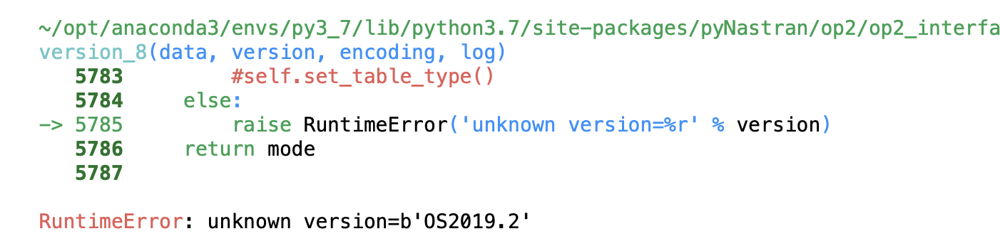
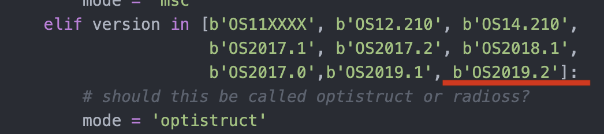

# OP_Map
OP_Map, version 1, by [Félix Ramón López Martínez](mailto:frlopezm@gmail.com), 2021

## Overview

OP_Map is a python library with functions and methods for easily reading .op2 files, plotting results in an element-mapping format and saving the results in a dedicated excel file.

An element-mapping is a group of finite elements that represents a structural part of the Finite Element Model of interest. Finite elements are named by their identification number and they are usually arranged in the mapping in such a spatial way that they resemble the structural part they represent.

OP_Map will read and presents the results asked for as they are in the OP2 file. In this respect, remember that the results in the op2 file are given in element coordinates. If you need to extract them in material coordinates, OP_Map can also do that for you in a simple way.

OP_Map is able to deal with any .op2 file generated by any solver that can be parsed by pyNastran such as NAS produced by different solvers such as NASTRAN or OPTISTRUCT.

The current version of OP_Map is able to deal with element forces from cquad and ctria NASTRAN elements. The interaction with the library is carry out by means of simple commands in a jupyter notebook.

The core of the library is based on the capabilities of **[pyNastran](https://pynastran-git.readthedocs.io/en/latest/#)**, an interface library to the various Nastran file formats (BDF, OP2, OP4) developed by [Steven Doyle](mailto:mesheb82@gmail.com)

### Capabilities of OP-Map
+ read .op2 files created with solver NASTRAN, Altair OPTISTRUCT
+ transform .op2 2D-element results from element coordinate (native format in .op2) to material coordinates for 2D elements
+ plot element mappings of specific structural components as defined in the mapping file.
+ plot mappings of element forces for a specific component and a single load case
+ plot mappings of maximum, minimum or maximum absolute element forces for a specific component for all load cases included in the .op2 file
+ change the mapping file initially loaded for a new one
+ list all load cases in the loaded .op2 file
+ save all results in a dedicated Excel workbook

###  Input OP_Map files
OP_Ma requires two mandatory files for running:
+ .op2 file with the results of FEM under consideration; it must have been solved to provide element forces in cquad and/or ctria elements 
+ mapping file (in .json format) of the structural part of interest; for building the element mapping in the required format, use the auxiliary jupyter notebook "json-builder.ipnb" file also provided with OP_Map.

Moreover, if the element results need to be transformed from element coordinates to material coordinates the following file is also required:
+ .bdf file associated to the previous .op2 file;

## OP_Map installation
Download the file 'OP_Map.py' and copy it in your working directory.

In addition, you can also download the how_to_use_OP_map.ipynb file, which contains some applications examples of the OP_Map library.

### Python version and required libraries
OP_Map runs in a Jupyter Notebook and requires Python 3.7 or higher. Moreover, the following libraries are called by OP_Map and, therefore, must be installed in the working environment:
+ pyNastran
+ numpy 
+ pandas
+ seaborn 
+ matplotlib
+ os
+ io
+ PIL
+ openpyxl
+ json

### Spetial caution for apparently pyNastran non supported versions of OPTISTRUCT
As said before in the overview, OP_Map is based on the library pyNastran.

PyNastran can deal with .op2 files coming from a number of solvers, such as NASTRAN or OPTISTRUCT. It might happen, however, that a fully operative .op2 file created with OPTISTRUCT trigger an error message like this: "RuntimeError: unknown version=b'OS2019.2'".

This is because the specific OPTISTRUCT version employed for generating the .op2 file is not within the list of OPTISTRUCT versions that manage the pyNastran library. To fix that, follow next steps:

1.- Locate file 'op2_reader.py' in the installation folder of pyNastran and open that file.

2.- Within the definition code for the function *_parse_nastran_version_8* find the 'elif' command that defines the versions for OPTISTRUCT, add the specific version of OPTISTRUCT that triggered the error (that indicated in the error message) and save the file without changing its name.

3.- Load again the OP_Map library and try again to run de code.

# Use of OP_Map
Open the Jupiter Notebook "How_to_use_OP_Map.ipynb". It will guide you with clear examples about through its capabilities.
